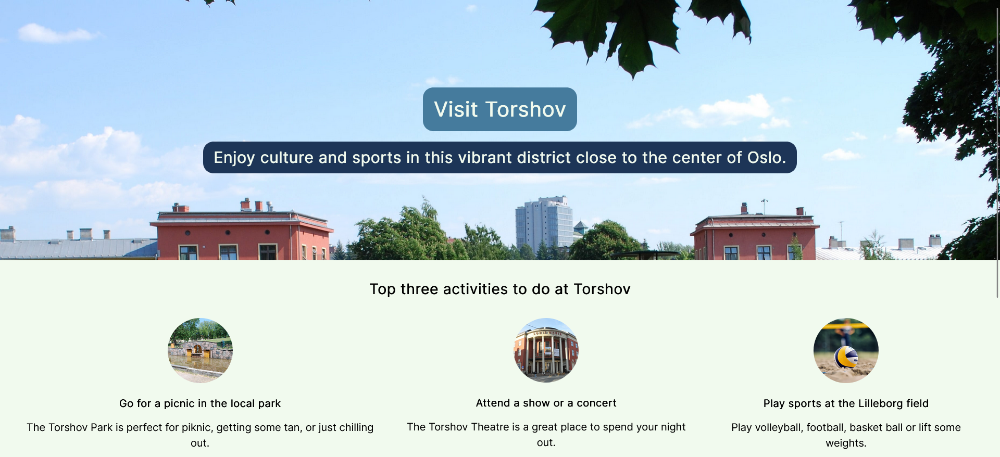
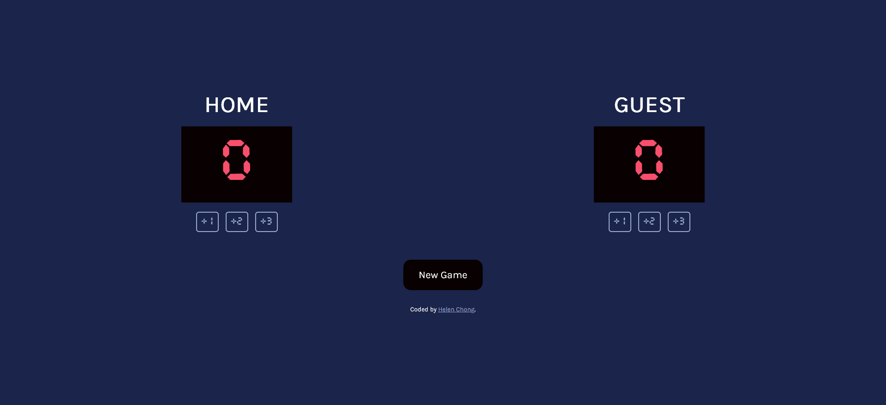
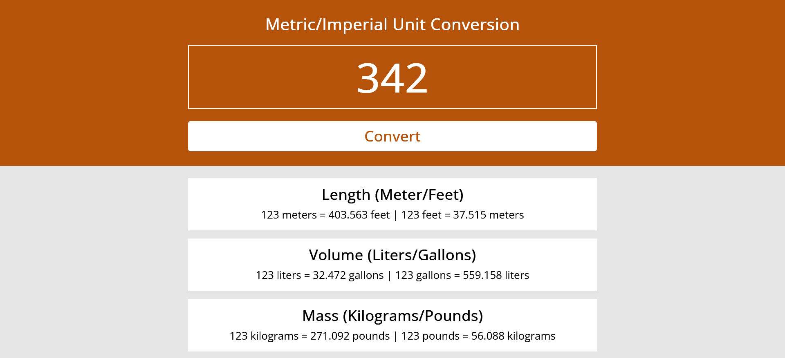
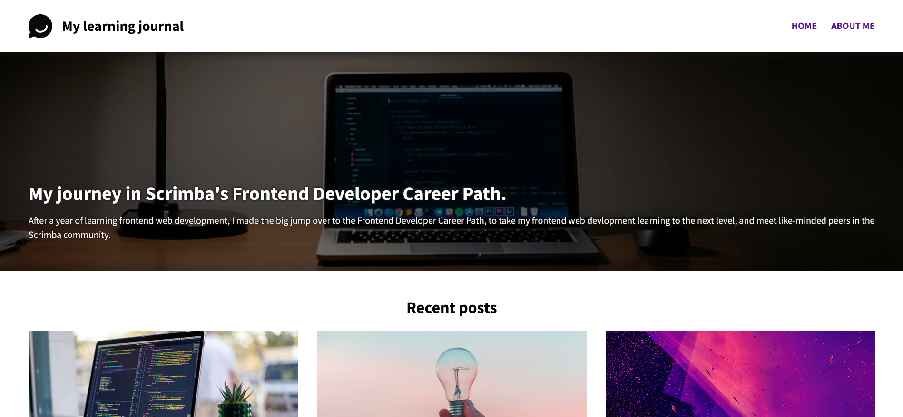
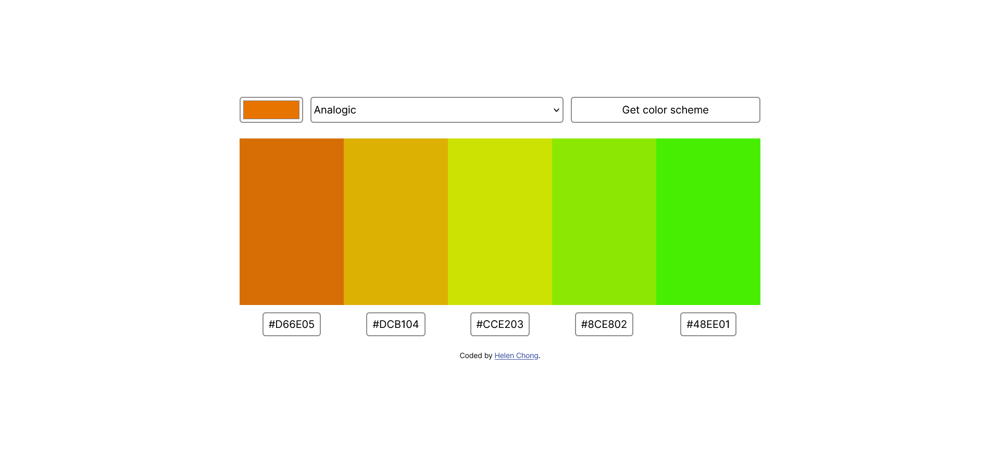
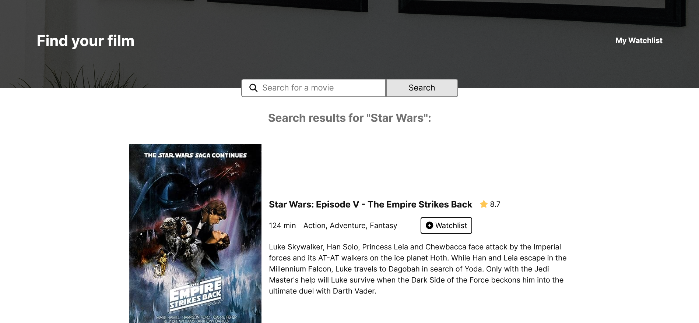

# Scrimba Frontend Developer Career Path - Solo Projects

My solo projects for Scrimba's Frontend Developer Career Path: https://scrimba.com/learn/frontend

## Module 2 - Web dev basics

### Hometown Homepage

- [Live site](https://helenchong.dev/Scrimba-Frontend-Solo-Projects/m2-hometown-homepage/)
- [Source code](https://github.com/helenclx/Scrimba-Frontend-Solo-Projects/tree/main/m2-hometown-homepage)

## Module 3 - Making websites interactive

### Basketball Scoreboard

- [Live site](https://helenchong.dev/Scrimba-Frontend-Solo-Projects/m3-basketball-scoreboard/)
- [Source code](https://github.com/helenclx/Scrimba-Frontend-Solo-Projects/tree/main/m3-basketball-scoreboard)

### Password Generator

- [Live site](https://helenchong.dev/Scrimba-Frontend-Solo-Projects/m3-password-generator/)
- [Source code](https://github.com/helenclx/Scrimba-Frontend-Solo-Projects/tree/main/m3-password-generator)

### Unit Converter

- [Live site](https://helenchong.dev/Scrimba-Frontend-Solo-Projects/m3-unit-converter/)
- [Source code](https://github.com/helenclx/Scrimba-Frontend-Solo-Projects/tree/main/m3-unit-converter)

### We are the Champions

- [Live site](https://helenchong.dev/Scrimba-Frontend-Solo-Projects/m3-we-are-the-champions/)
- [Source code](https://github.com/helenclx/Scrimba-Frontend-Solo-Projects/tree/main/m3-we-are-the-champions)

## Module 4 - Essential CSS Concepts

### Oldagram

- [Live site](https://helenchong.dev/Scrimba-Frontend-Solo-Projects/m4-oldagram/)
- [Source code](https://github.com/helenclx/Scrimba-Frontend-Solo-Projects/tree/main/m4-oldagram)

## Module 5 - Essential JavaScript Concepts

### Restaurant ordering app

- [Live site](https://helenchong.dev/Scrimba-Frontend-Solo-Projects/m5-restaurant-ordering-app/)
- [Source code](https://github.com/helenclx/Scrimba-Frontend-Solo-Projects/tree/main/m5-restaurant-ordering-app)

## Module 6 - Responsive Design

### Learning Journal

- [Live site](https://helenchong.dev/Scrimba-Frontend-Solo-Projects/m6-learning-journal/)
- [Source code](https://github.com/helenclx/Scrimba-Frontend-Solo-Projects/tree/main/m6-learning-journal)

## Module 8 - Working with APIs

### Color Scheme Generator

- [Live site](https://helenchong.dev/Scrimba-Frontend-Solo-Projects/m8-color-scheme-generator/)
- [Source code](https://github.com/helenclx/Scrimba-Frontend-Solo-Projects/tree/main/m8-color-scheme-generator)

### Movie Watchlist

- [Live site](https://helenchong.dev/Scrimba-Frontend-Solo-Projects/m8-movie-watchlist/)
- [Source code](https://github.com/helenclx/Scrimba-Frontend-Solo-Projects/tree/main/m8-movie-watchlist)